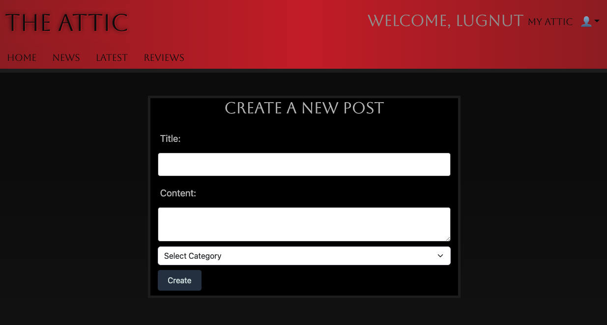

# THE ATTIC TECH BLOG

## Description

Are you interested in the technology they don't want you to know about?  If it is too taboo, too new or too out there, you can bet you'll find it here!

- Develop a niche tech corner and develop a community dedicated to interesting tech.
- It provides a home for conversations and products that might be really cool but not cool enough to make the cut on more popular, mainstream sites.
- That there is still a lot to learn!  This was a great exercise in working with databases, user login, authentication and standard CRUD.

## Table of Contents

- [Installation](#installation)
- [Usage](#usage)
- [Credits](#credits)
- [License](#license)

## Installation

Simply copy and paste the URL into your favorite browser.

## Usage

Upon opening the application in a browser window, the user will need to sign in or create an account.  From there they are able to make posts.

## Credits

N/A

## License

MIT License

## Questions

- Email: putzstuck@gmail.com
- GitHub Profile: https://github.com/argounova